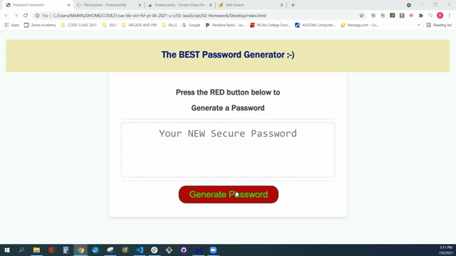

<h1>PassWord Generator </h1>
<h3>-by Ron Shutter </h3> 

<h2> What's inside </h2>

 A quick way to generate a secret password that could contain four possible combinations.

First a user must choose the length from 8 to 128 characters long.  After that the following choices must be made:

<li>  Do you want upper case characters?</li>
<li> Do you want lower case characters? </li>
<li> Do you want numbers?</li>
<li> Do you want special characters?</li>
NOTE: The user must choose at least one option or it will return to the start.

<h3> The user is then presented the final password  </h3>
 

<h2>  EXAMPLE of the final product in use: </h2> 

